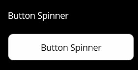
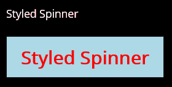

# MauiButtonSpinner
A simple example of a button spinner. when the bound command is executing, an activity spinner will be displayed within the button.

> This control is a very Xamarin approach, I believe a better implementation would be possible using a `ButtonHandler` and implementing the spinner on each platform. The advantage would be all styling would be inherited, the disadvantage being complexity!

## Usage

- Add `ButtonSpinner.cs` to your project
- Reference xml namespace: `xmlns:controls="clr-namespace:ButtonSpinner.Controls"`
- Add to content:
```xml
<controls:ButtonSpinner
    Margin="0,0,0,20"
    BackgroundColor="LightBlue"
    Command="{Binding DoSomethingCommand}"
    CornerRadius="0"
    FontAttributes="Bold"
    FontSize="Title"
    IndicatorColor="Yellow"
    Text="Styled Spinner"
    TextColor="Red" />
```

## Appearance

The default appearance:



With styling (this looks ghastly, but gives a basic idea):

